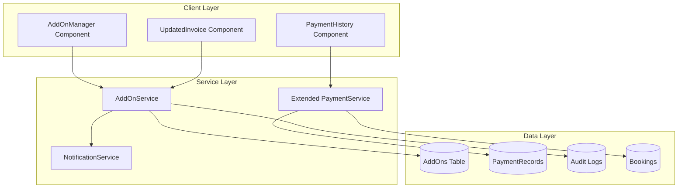

# Post-Booking Add-On System Architecture

## Overview
Design for a comprehensive post-booking add-on system for a photography studio management application that allows adding extra services after initial booking with proper financial attribution, multi-currency support, and audit trails.

## System Architecture



## Data Models

### 1. AddOn Types

```typescript
// types/addon.types.ts

export type AddOnStatus = 'pending' | 'approved' | 'rejected' | 'invoiced' | 'paid';

export type AddOnCategory = 
  | 'additional_edits'
  | 'extra_prints'
  | 'album_upgrade'
  | 'additional_hours'
  | 'special_effects'
  | 'rush_delivery'
  | 'custom_request';

export interface AddOnItem {
  id: string;
  bookingId: string;
  category: AddOnCategory;
  description: string;
  amount: number;
  currency: Currency;
  exchangeRate: number; // IQD per USD at time of creation
  convertedAmount: number; // Amount in IQD
  status: AddOnStatus;
  
  // Authorization tracking
  requestedBy: string; // User ID
  requestedByName: string;
  requestedAt: string;
  approvedBy?: string; // User ID
  approvedByName?: string;
  approvedAt?: string;
  
  // Financial attribution
  originalPackagePrice: number; // Snapshot of package price at creation
  previousTotal: number; // Total before this add-on
  newTotal: number; // Total after this add-on
  
  // Customer notification
  customerNotifiedAt?: string;
  notificationMethod?: 'whatsapp' | 'sms' | 'email';
  
  // Invoice tracking
  invoiceId?: string;
  invoicedAt?: string;
  
  // Payment tracking
  paymentRecordId?: string;
  paidAt?: string;
  
  // Metadata
  notes?: string;
  createdAt: string;
  updatedAt: string;
  deletedAt?: number;
}

export interface AddOnSummary {
  bookingId: string;
  originalPackagePrice: number;
  totalAddOns: number;
  totalAddOnAmount: number;
  currentTotal: number;
  paidAmount: number;
  remainingBalance: number;
  currency: Currency;
  items: AddOnItem[];
}

export interface AddOnAuditEntry {
  id: string;
  addOnId: string;
  bookingId: string;
  action: 'created' | 'approved' | 'rejected' | 'modified' | 'deleted' | 'invoiced' | 'paid';
  performedBy: string;
  performedByName: string;
  performedAt: string;
  details: string;
  oldValues?: Partial<AddOnItem>;
  newValues?: Partial<AddOnItem>;
}
```

### 2. Extended Booking Type

```typescript
// Extensions to existing Booking type

export interface Booking {
  // ... existing fields ...
  
  // Add-on tracking
  addOns?: AddOnItem[];
  originalPackagePrice: number; // Immutable - set at booking creation
  addOnTotal: number; // Sum of all approved add-ons
  
  // Enhanced payment tracking
  paymentHistory: PaymentHistoryEntry[];
  
  // Invoice tracking
  invoiceHistory: InvoiceEntry[];
}

export interface PaymentHistoryEntry {
  id: string;
  amount: number;
  currency: Currency;
  exchangeRate: number;
  convertedAmount: number;
  type: 'initial_deposit' | 'installment' | 'add_on_payment' | 'final_settlement';
  relatedAddOnId?: string;
  paidAt: string;
  receivedBy: string;
  paymentMethod: 'Cash' | 'Mastercard' | 'ZainCash';
  notes?: string;
}

export interface InvoiceEntry {
  id: string;
  invoiceNumber: string;
  type: 'original' | 'updated' | 'add_on';
  generatedAt: string;
  generatedBy: string;
  totalAmount: number;
  currency: Currency;
  addOnIds?: string[];
  pdfUrl?: string;
  sentToCustomer: boolean;
  sentAt?: string;
}
```

### 3. Database Schema Extensions

```typescript
// services/db/types.ts additions

export interface AddOnsTable {
  id: string;
  bookingId: string;
  category: string;
  description: string;
  amount: number;
  currency: string;
  exchangeRate: number;
  convertedAmount: number;
  status: string;
  requestedBy: string;
  requestedByName: string;
  requestedAt: string;
  approvedBy: string | null;
  approvedByName: string | null;
  approvedAt: string | null;
  originalPackagePrice: number;
  previousTotal: number;
  newTotal: number;
  customerNotifiedAt: string | null;
  notificationMethod: string | null;
  invoiceId: string | null;
  invoicedAt: string | null;
  paymentRecordId: string | null;
  paidAt: string | null;
  notes: string | null;
  createdAt: string;
  updatedAt: string;
  deletedAt: number | null;
}

export interface AddOnAuditTable {
  id: string;
  addOnId: string;
  bookingId: string;
  action: string;
  performedBy: string;
  performedByName: string;
  performedAt: string;
  details: string;
  oldValues: string | null; // JSON
  newValues: string | null; // JSON
}
```

## Service Layer

### AddOnService

```typescript
// services/db/services/AddOnService.ts

export class AddOnService {
  /**
   * Create a new add-on request
   */
  async createAddOn(
    bookingId: string,
    data: Omit<AddOnItem, 'id' | 'requestedAt' | 'createdAt' | 'updatedAt'>,
    user: { id: string; name: string }
  ): Promise<AddOnItem> {
    const booking = await bookingRepo.getById(bookingId);
    if (!booking) throw new Error('Booking not found');
    
    const addOn: AddOnItem = {
      id: `addon_${Date.now()}`,
      ...data,
      requestedBy: user.id,
      requestedByName: user.name,
      requestedAt: new Date().toISOString(),
      createdAt: new Date().toISOString(),
      updatedAt: new Date().toISOString(),
      originalPackagePrice: booking.originalPackagePrice || booking.totalAmount,
      previousTotal: booking.totalAmount,
      newTotal: booking.totalAmount + data.amount,
      status: 'pending',
    };
    
    // Save to database
    await addOnRepo.create(addOn);
    
    // Log audit entry
    await this.logAuditEntry({
      addOnId: addOn.id,
      bookingId,
      action: 'created',
      performedBy: user.id,
      performedByName: user.name,
      details: `Add-on created: ${data.description} (${data.amount} ${data.currency})`,
      newValues: addOn,
    });
    
    return addOn;
  }
  
  /**
   * Approve an add-on (requires manager/admin approval)
   */
  async approveAddOn(
    addOnId: string,
    user: { id: string; name: string; role: UserRole }
  ): Promise<AddOnItem> {
    // Verify permissions
    if (!ROLE_PERMISSIONS[user.role].canApproveAddOns) {
      throw new Error('Insufficient permissions to approve add-ons');
    }
    
    const addOn = await addOnRepo.getById(addOnId);
    if (!addOn) throw new Error('Add-on not found');
    if (addOn.status !== 'pending') {
      throw new Error(`Cannot approve add-on with status: ${addOn.status}`);
    }
    
    const updates: Partial<AddOnItem> = {
      status: 'approved',
      approvedBy: user.id,
      approvedByName: user.name,
      approvedAt: new Date().toISOString(),
      updatedAt: new Date().toISOString(),
    };
    
    await addOnRepo.update(addOnId, updates);
    
    // Update booking total
    await bookingRepo.update(addOn.bookingId, {
      totalAmount: addOn.newTotal,
      addOnTotal: (await this.getAddOnTotal(addOn.bookingId)),
    });
    
    // Log audit
    await this.logAuditEntry({
      addOnId,
      bookingId: addOn.bookingId,
      action: 'approved',
      performedBy: user.id,
      performedByName: user.name,
      details: `Add-on approved by ${user.name}`,
      oldValues: { status: 'pending' },
      newValues: updates,
    });
    
    // Send customer notification
    await this.notifyCustomer(addOn);
    
    return { ...addOn, ...updates };
  }
  
  /**
   * Get add-on summary for a booking
   */
  async getAddOnSummary(bookingId: string): Promise<AddOnSummary> {
    const booking = await bookingRepo.getById(bookingId);
    if (!booking) throw new Error('Booking not found');
    
    const items = await addOnRepo.getByBookingId(bookingId);
    const approvedItems = items.filter(i => i.status === 'approved' || i.status === 'paid');
    
    return {
      bookingId,
      originalPackagePrice: booking.originalPackagePrice || booking.totalAmount,
      totalAddOns: approvedItems.length,
      totalAddOnAmount: approvedItems.reduce((sum, i) => sum + i.amount, 0),
      currentTotal: booking.totalAmount,
      paidAmount: booking.paidAmount,
      remainingBalance: booking.totalAmount - booking.paidAmount,
      currency: booking.currency,
      items,
    };
  }
  
  /**
   * Generate updated invoice including add-ons
   */
  async generateUpdatedInvoice(
    bookingId: string,
    addOnIds: string[],
    user: { id: string; name: string }
  ): Promise<InvoiceEntry> {
    const booking = await bookingRepo.getById(bookingId);
    const addOns = await addOnRepo.getByIds(addOnIds);
    
    const invoice: InvoiceEntry = {
      id: `inv_${Date.now()}`,
      invoiceNumber: await this.generateInvoiceNumber(bookingId),
      type: addOns.length > 0 ? 'add_on' : 'updated',
      generatedAt: new Date().toISOString(),
      generatedBy: user.id,
      totalAmount: booking.totalAmount,
      currency: booking.currency,
      addOnIds,
      sentToCustomer: false,
    };
    
    // Update add-ons with invoice reference
    for (const addOn of addOns) {
      await addOnRepo.update(addOn.id, {
        invoiceId: invoice.id,
        invoicedAt: invoice.generatedAt,
        status: 'invoiced',
      });
    }
    
    // Save invoice to booking history
    await bookingRepo.appendInvoice(bookingId, invoice);
    
    return invoice;
  }
  
  private async logAuditEntry(entry: Omit<AddOnAuditEntry, 'id' | 'performedAt'>): Promise<void> {
    await auditRepo.create({
      id: `audit_${Date.now()}`,
      ...entry,
      performedAt: new Date().toISOString(),
    });
  }
  
  private async notifyCustomer(addOn: AddOnItem): Promise<void> {
    const booking = await bookingRepo.getById(addOn.bookingId);
    if (!booking) return;
    
    // Generate WhatsApp message
    const message = this.generateAddOnNotificationMessage(addOn, booking);
    
    // Queue notification
    await notificationService.queueNotification({
      bookingId: addOn.bookingId,
      type: 'add_on_approved',
      method: 'whatsapp',
      recipient: booking.clientPhone,
      message,
      scheduledAt: new Date().toISOString(),
    });
    
    // Update add-on with notification timestamp
    await addOnRepo.update(addOn.id, {
      customerNotifiedAt: new Date().toISOString(),
      notificationMethod: 'whatsapp',
    });
  }
}
```

### Extended PaymentService

```typescript
// services/db/services/PaymentService.ts - Extensions

export class PaymentService {
  // ... existing methods ...
  
  /**
   * Add payment specifically for an add-on
   */
  async addAddOnPayment(
    bookingId: string,
    addOnId: string,
    paymentData: {
      amount: number;
      currency: Currency;
      exchangeRate: number;
      paymentMethod: 'Cash' | 'Mastercard' | 'ZainCash';
      notes?: string;
    },
    user: { id: string; name: string }
  ): Promise<PaymentRecord> {
    const booking = await bookingRepo.getById(bookingId);
    const addOn = await addOnRepo.getById(addOnId);
    
    if (!booking || !addOn) {
      throw new Error('Booking or add-on not found');
    }
    
    // Create payment record
    const payment: PaymentRecord = {
      id: `pay_${Date.now()}`,
      bookingId,
      amount: paymentData.amount,
      currency: paymentData.currency,
      exchangeRate: paymentData.exchangeRate,
      convertedAmount: paymentData.currency === 'USD' 
        ? paymentData.amount * paymentData.exchangeRate 
        : paymentData.amount,
      type: 'add_on_payment',
      relatedAddOnId: addOnId,
      paidAt: new Date().toISOString(),
      receivedBy: user.name,
      paymentMethod: paymentData.paymentMethod,
      notes: paymentData.notes || `Payment for add-on: ${addOn.description}`,
    };
    
    // Save payment
    await paymentRepo.create(payment);
    
    // Update booking paid amount
    const newPaidAmount = booking.paidAmount + paymentData.amount;
    await bookingRepo.update(bookingId, { 
      paidAmount: newPaidAmount,
    });
    
    // Update add-on status
    await addOnRepo.update(addOnId, {
      status: 'paid',
      paymentRecordId: payment.id,
      paidAt: payment.paidAt,
    });
    
    // Log to payment history
    await bookingRepo.appendPaymentHistory(bookingId, payment);
    
    return payment;
  }
  
  /**
   * Get complete payment history with exchange rate details
   */
  async getPaymentHistory(bookingId: string): Promise<PaymentHistoryEntry[]> {
    const booking = await bookingRepo.getById(bookingId);
    if (!booking) throw new Error('Booking not found');
    
    return booking.paymentHistory || [];
  }
  
  /**
   * Settle remaining balance with add-on awareness
   */
  async settlePaymentWithAddOns(
    bookingId: string,
    collectedBy: string,
    currentExchangeRate?: number
  ): Promise<{ payment: PaymentRecord; remainingBalance: number }> {
    const booking = await bookingRepo.getById(bookingId);
    if (!booking) throw new Error('Booking not found');
    
    const remaining = booking.totalAmount - booking.paidAmount;
    if (remaining <= 0) {
      return { payment: null as any, remainingBalance: 0 };
    }
    
    const rateToUse = currentExchangeRate || booking.exchangeRate || 1400;
    
    // Create final settlement payment record
    const payment: PaymentRecord = {
      id: `pay_${Date.now()}`,
      bookingId,
      amount: remaining,
      currency: booking.currency,
      exchangeRate: rateToUse,
      convertedAmount: booking.currency === 'USD' ? remaining * rateToUse : remaining,
      type: 'final_settlement',
      paidAt: new Date().toISOString(),
      receivedBy: collectedBy,
      paymentMethod: 'Cash',
      notes: 'تسوية المبلغ المتبقي شامل الإضافات',
    };
    
    await paymentRepo.create(payment);
    await bookingRepo.update(bookingId, { 
      paidAmount: booking.totalAmount,
    });
    await bookingRepo.appendPaymentHistory(bookingId, payment);
    
    return { payment, remainingBalance: 0 };
  }
}
```

## UI Components

### AddOnManager Component

```typescript
// components/addons/AddOnManager.tsx

interface AddOnManagerProps {
  booking: Booking;
  currentUser: User;
  onAddOnCreated: (addOn: AddOnItem) => void;
  onAddOnApproved: (addOn: AddOnItem) => void;
  onInvoiceGenerated: (invoice: InvoiceEntry) => void;
}

export const AddOnManager: React.FC<AddOnManagerProps> = ({
  booking,
  currentUser,
  onAddOnCreated,
  onAddOnApproved,
  onInvoiceGenerated,
}) => {
  const [addOns, setAddOns] = useState<AddOnItem[]>([]);
  const [showCreateModal, setShowCreateModal] = useState(false);
  const [selectedAddOns, setSelectedAddOns] = useState<string[]>([]);
  
  const canApprove = ROLE_PERMISSIONS[currentUser.role].canApproveAddOns;
  
  return (
    <div className="space-y-6">
      {/* Original Package Price Display */}
      <div className="bg-gray-50 p-4 rounded-xl border border-gray-200">
        <div className="flex justify-between items-center">
          <span className="text-sm text-gray-600">سعر الباقة الأصلي</span>
          <span className="text-lg font-bold">
            {formatMoney(booking.originalPackagePrice || booking.totalAmount, booking.currency)}
          </span>
        </div>
      </div>
      
      {/* Add-On List */}
      <div className="space-y-3">
        {addOns.map(addOn => (
          <AddOnCard
            key={addOn.id}
            addOn={addOn}
            canApprove={canApprove}
            onApprove={() => handleApprove(addOn.id)}
            onSelect={() => toggleSelection(addOn.id)}
            isSelected={selectedAddOns.includes(addOn.id)}
          />
        ))}
      </div>
      
      {/* Actions */}
      <div className="flex gap-3">
        <Button onClick={() => setShowCreateModal(true)}>
          إضافة خدمة جديدة
        </Button>
        {selectedAddOns.length > 0 && (
          <Button onClick={handleGenerateInvoice} variant="secondary">
            إنشاء فاتورة محدثة
          </Button>
        )}
      </div>
      
      {/* Create Modal */}
      <AddOnCreateModal
        isOpen={showCreateModal}
        onClose={() => setShowCreateModal(false)}
        booking={booking}
        onSubmit={handleCreateAddOn}
      />
    </div>
  );
};
```

### PaymentHistory Component

```typescript
// components/payments/PaymentHistory.tsx

interface PaymentHistoryProps {
  booking: Booking;
  payments: PaymentHistoryEntry[];
}

export const PaymentHistory: React.FC<PaymentHistoryProps> = ({
  booking,
  payments,
}) => {
  return (
    <div className="space-y-4">
      <h3 className="text-lg font-bold">سجل المدفوعات</h3>
      
      <div className="overflow-x-auto">
        <table className="w-full">
          <thead>
            <tr className="bg-gray-50">
              <th className="p-3 text-right">التاريخ</th>
              <th className="p-3 text-right">نوع الدفعة</th>
              <th className="p-3 text-right">المبلغ</th>
              <th className="p-3 text-right">سعر الصرف</th>
              <th className="p-3 text-right">المحول (د.ع)</th>
              <th className="p-3 text-right">طريقة الدفع</th>
              <th className="p-3 text-right">المستلم</th>
            </tr>
          </thead>
          <tbody>
            {payments.map(payment => (
              <tr key={payment.id} className="border-b">
                <td className="p-3">{formatDate(payment.paidAt)}</td>
                <td className="p-3">
                  <PaymentTypeBadge type={payment.type} />
                </td>
                <td className="p-3 font-bold">
                  {formatMoney(payment.amount, payment.currency)}
                </td>
                <td className="p-3 text-gray-600">
                  {payment.exchangeRate.toLocaleString()}
                </td>
                <td className="p-3 text-emerald-600">
                  {formatMoney(payment.convertedAmount, 'IQD')}
                </td>
                <td className="p-3">{payment.paymentMethod}</td>
                <td className="p-3 text-sm">{payment.receivedBy}</td>
              </tr>
            ))}
          </tbody>
        </table>
      </div>
      
      {/* Summary */}
      <div className="bg-emerald-50 p-4 rounded-xl border border-emerald-200">
        <div className="flex justify-between items-center">
          <span className="text-emerald-800">إجمالي المدفوع</span>
          <span className="text-xl font-bold text-emerald-700">
            {formatMoney(booking.paidAmount, booking.currency)}
          </span>
        </div>
        <div className="flex justify-between items-center mt-2">
          <span className="text-gray-600">المتبقي</span>
          <span className="text-lg font-bold text-rose-600">
            {formatMoney(booking.totalAmount - booking.paidAmount, booking.currency)}
          </span>
        </div>
      </div>
    </div>
  );
};
```

### UpdatedInvoice Component

```typescript
// components/invoices/UpdatedInvoice.tsx

interface UpdatedInvoiceProps {
  booking: Booking;
  addOns: AddOnItem[];
  invoice: InvoiceEntry;
  onSendToCustomer: () => void;
  onDownloadPDF: () => void;
}

export const UpdatedInvoice: React.FC<UpdatedInvoiceProps> = ({
  booking,
  addOns,
  invoice,
  onSendToCustomer,
  onDownloadPDF,
}) => {
  const originalPrice = booking.originalPackagePrice || booking.totalAmount;
  const addOnsTotal = addOns.reduce((sum, a) => sum + a.amount, 0);
  
  return (
    <div className="bg-white p-8 rounded-2xl shadow-lg border border-gray-200">
      <div className="flex justify-between items-start mb-8">
        <div>
          <h2 className="text-2xl font-bold">فاتورة محدثة</h2>
          <p className="text-gray-600">رقم: {invoice.invoiceNumber}</p>
          <p className="text-gray-600">التاريخ: {formatDate(invoice.generatedAt)}</p>
        </div>
        <div className="text-left">
          <p className="font-bold">{booking.clientName}</p>
          <p className="text-gray-600">{booking.clientPhone}</p>
        </div>
      </div>
      
      {/* Original Package */}
      <div className="mb-6">
        <h3 className="text-lg font-bold mb-3">الباقة الأصلية</h3>
        <div className="bg-gray-50 p-4 rounded-lg">
          <div className="flex justify-between">
            <span>{booking.servicePackage}</span>
            <span className="font-bold">{formatMoney(originalPrice, booking.currency)}</span>
          </div>
        </div>
      </div>
      
      {/* Add-Ons */}
      {addOns.length > 0 && (
        <div className="mb-6">
          <h3 className="text-lg font-bold mb-3">الخدمات الإضافية</h3>
          <div className="space-y-2">
            {addOns.map(addOn => (
              <div key={addOn.id} className="flex justify-between p-3 bg-blue-50 rounded-lg">
                <div>
                  <span className="font-medium">{addOn.description}</span>
                  <span className="text-xs text-gray-500 block">
                    تمت الموافقة بواسطة: {addOn.approvedByName}
                  </span>
                </div>
                <span className="font-bold">+{formatMoney(addOn.amount, addOn.currency)}</span>
              </div>
            ))}
          </div>
          <div className="flex justify-between mt-3 p-3 bg-blue-100 rounded-lg">
            <span className="font-bold">إجمالي الإضافات</span>
            <span className="font-bold">{formatMoney(addOnsTotal, booking.currency)}</span>
          </div>
        </div>
      )}
      
      {/* Total */}
      <div className="border-t pt-4 mt-6">
        <div className="flex justify-between items-center">
          <span className="text-xl font-bold">الإجمالي الكلي</span>
          <span className="text-2xl font-bold text-emerald-600">
            {formatMoney(invoice.totalAmount, invoice.currency)}
          </span>
        </div>
        <div className="flex justify-between items-center mt-2 text-gray-600">
          <span>المدفوع سابقاً</span>
          <span>{formatMoney(booking.paidAmount, booking.currency)}</span>
        </div>
        <div className="flex justify-between items-center mt-2 text-rose-600">
          <span className="font-bold">المتبقي للدفع</span>
          <span className="font-bold">
            {formatMoney(invoice.totalAmount - booking.paidAmount, invoice.currency)}
          </span>
        </div>
      </div>
      
      {/* Actions */}
      <div className="flex gap-3 mt-8">
        <Button onClick={onSendToCustomer} variant="primary">
          إرسال للعميل عبر واتساب
        </Button>
        <Button onClick={onDownloadPDF} variant="secondary">
          تحميل PDF
        </Button>
      </div>
    </div>
  );
};
```

## Integration Points

### 1. App.tsx Integration

```typescript
// App.tsx - Add to AppContent

const handleAddAddOn = async (bookingId: string, addOnData: AddOnCreateData) => {
  const addOn = await addOnService.createAddOn(
    bookingId,
    addOnData,
    { id: currentUser.id, name: currentUser.name }
  );
  
  // Refresh booking data
  await refreshBooking(bookingId);
  
  toast.success('تم إنشاء طلب الخدمة الإضافية');
  return addOn;
};

const handleApproveAddOn = async (addOnId: string) => {
  const addOn = await addOnService.approveAddOn(
    addOnId,
    { id: currentUser.id, name: currentUser.name, role: currentUser.role }
  );
  
  await refreshBooking(addOn.bookingId);
  
  toast.success('تمت الموافقة على الخدمة الإضافية');
  return addOn;
};

// Extend settlePayment to handle add-ons
const handleSettlePayment = async (amountInput?: number, currentExchangeRate?: number) => {
  const targetBooking = paymentContextBooking || selectedBooking;
  if (!targetBooking) return;
  
  // Check for pending add-ons
  const pendingAddOns = await addOnService.getPendingAddOns(targetBooking.id);
  if (pendingAddOns.length > 0) {
    toast.error('يوجد طلبات خدمات إضافية بانتظار الموافقة');
    return;
  }
  
  // Use enhanced payment service
  const result = await paymentService.settlePaymentWithAddOns(
    targetBooking.id,
    currentUser.name,
    currentExchangeRate
  );
  
  // ... rest of existing logic
};
```

### 2. SyncQueue Extension

```typescript
// services/sync/SyncQueue.ts

export type SyncEntity = 
  | 'booking' 
  | 'user' 
  | 'attendance' 
  | 'leave' 
  | 'activity_log'
  | 'add_on'
  | 'add_on_audit'
  | 'payment_record'
  | 'invoice';
```

### 3. Role Permissions Extension

```typescript
// types/index.ts

export interface RolePermissions {
  // ... existing permissions ...
  canCreateAddOns: boolean;
  canApproveAddOns: boolean;
  canViewAddOnHistory: boolean;
  canGenerateInvoices: boolean;
}

export const ROLE_PERMISSIONS: Record<UserRole, RolePermissions> = {
  [UserRole.MANAGER]: {
    // ... existing ...
    canCreateAddOns: true,
    canApproveAddOns: true,
    canViewAddOnHistory: true,
    canGenerateInvoices: true,
  },
  [UserRole.RECEPTION]: {
    // ... existing ...
    canCreateAddOns: true,
    canApproveAddOns: false,
    canViewAddOnHistory: true,
    canGenerateInvoices: false,
  },
  // ... other roles ...
};
```

## Database Migration

```sql
-- Add-ons table
CREATE TABLE IF NOT EXISTS add_ons (
  id TEXT PRIMARY KEY,
  booking_id TEXT NOT NULL REFERENCES bookings(id) ON DELETE CASCADE,
  category TEXT NOT NULL,
  description TEXT NOT NULL,
  amount REAL NOT NULL,
  currency TEXT NOT NULL DEFAULT 'IQD',
  exchange_rate REAL NOT NULL,
  converted_amount REAL NOT NULL,
  status TEXT NOT NULL DEFAULT 'pending',
  requested_by TEXT NOT NULL,
  requested_by_name TEXT NOT NULL,
  requested_at TEXT NOT NULL,
  approved_by TEXT,
  approved_by_name TEXT,
  approved_at TEXT,
  original_package_price REAL NOT NULL,
  previous_total REAL NOT NULL,
  new_total REAL NOT NULL,
  customer_notified_at TEXT,
  notification_method TEXT,
  invoice_id TEXT,
  invoiced_at TEXT,
  payment_record_id TEXT,
  paid_at TEXT,
  notes TEXT,
  created_at TEXT NOT NULL,
  updated_at TEXT NOT NULL,
  deleted_at INTEGER
);

-- Add-on audit table
CREATE TABLE IF NOT EXISTS add_on_audit (
  id TEXT PRIMARY KEY,
  add_on_id TEXT NOT NULL,
  booking_id TEXT NOT NULL,
  action TEXT NOT NULL,
  performed_by TEXT NOT NULL,
  performed_by_name TEXT NOT NULL,
  performed_at TEXT NOT NULL,
  details TEXT NOT NULL,
  old_values TEXT,
  new_values TEXT
);

-- Indexes
CREATE INDEX idx_add_ons_booking_id ON add_ons(booking_id);
CREATE INDEX idx_add_ons_status ON add_ons(status);
CREATE INDEX idx_add_on_audit_add_on_id ON add_on_audit(add_on_id);
CREATE INDEX idx_add_on_audit_booking_id ON add_on_audit(booking_id);

-- Add columns to bookings table
ALTER TABLE bookings ADD COLUMN original_package_price REAL;
ALTER TABLE bookings ADD COLUMN add_on_total REAL DEFAULT 0;
ALTER TABLE bookings ADD COLUMN payment_history TEXT; -- JSON array
ALTER TABLE bookings ADD COLUMN invoice_history TEXT; -- JSON array
```

## Notification Templates

```typescript
// utils/addOnNotifications.ts

export const generateAddOnApprovedMessage = (
  addOn: AddOnItem,
  booking: Booking
): string => {
  const remainingBalance = addOn.newTotal - booking.paidAmount;
  
  return `
مرحباً ${booking.clientName}،

تمت الموافقة على الخدمة الإضافية التالية:
📋 ${addOn.description}
💰 المبلغ: ${formatMoney(addOn.amount, addOn.currency)}

الفاتورة المحدثة:
━━━━━━━━━━━━━━━
الباقة الأصلية: ${formatMoney(addOn.originalPackagePrice, booking.currency)}
الإضافات: ${formatMoney(addOn.amount, addOn.currency)}
الإجمالي الجديد: ${formatMoney(addOn.newTotal, booking.currency)}
المدفوع: ${formatMoney(booking.paidAmount, booking.currency)}
المتبقي: ${formatMoney(remainingBalance, booking.currency)}
━━━━━━━━━━━━━━━

للاستفسار، يرجى التواصل معنا.
شكراً لاختياركم فيلا حداد 📸
  `.trim();
};

export const generateAddOnRequestMessage = (
  addOn: AddOnItem,
  booking: Booking
): string => {
  return `
مرحباً ${booking.clientName}،

نود إعلامكم بوجود خدمة إضافية مقترحة:
📋 ${addOn.description}
💰 المبلغ: ${formatMoney(addOn.amount, addOn.currency)}

في انتظار موافقتكم.

للموافقة، يرجى الرد على هذه الرسالة أو الاتصال بنا.
  `.trim();
};
```

## Usage Examples

### Example 1: Creating an Add-On

```typescript
// Reception creates an add-on request
const addOn = await addOnService.createAddOn(
  'booking_123',
  {
    category: 'additional_edits',
    description: 'تعديلات إضافية - 10 صور',
    amount: 100000,
    currency: 'IQD',
    exchangeRate: 1450,
    convertedAmount: 100000,
  },
  { id: 'user_rec_1', name: 'أحمد' }
);
// Status: pending, awaiting manager approval
```

### Example 2: Approving and Processing Payment

```typescript
// Manager approves the add-on
const approvedAddOn = await addOnService.approveAddOn(
  addOn.id,
  { id: 'user_mgr_1', name: 'المديرة', role: UserRole.MANAGER }
);

// Customer is automatically notified via WhatsApp

// Customer pays for the add-on
const payment = await paymentService.addAddOnPayment(
  booking.id,
  approvedAddOn.id,
  {
    amount: 100000,
    currency: 'IQD',
    exchangeRate: 1450,
    paymentMethod: 'Cash',
  },
  { id: 'user_rec_1', name: 'أحمد' }
);
```

### Example 3: Generating Updated Invoice

```typescript
// Generate invoice with all approved add-ons
const invoice = await addOnService.generateUpdatedInvoice(
  booking.id,
  addOns.filter(a => a.status === 'approved').map(a => a.id),
  { id: currentUser.id, name: currentUser.name }
);

// Send to customer
await sendInvoiceViaWhatsApp(booking.clientPhone, invoice);
```

## Summary

This architecture provides:

1. **Financial Attribution**: Clear tracking of original package price vs. add-ons
2. **Complete Payment History**: Every transaction with exchange rates and timestamps
3. **Multi-Currency Support**: IQD and USD with per-transaction exchange rates
4. **Updated Invoices**: Reflect revised totals while preserving original terms
5. **Customer Notifications**: Automated WhatsApp notifications for balance changes
6. **Audit Trails**: Complete history of who authorized each add-on and when
7. **Integration**: Seamless integration with existing settlePayment workflow
8. **Offline Support**: Works with existing sync infrastructure
